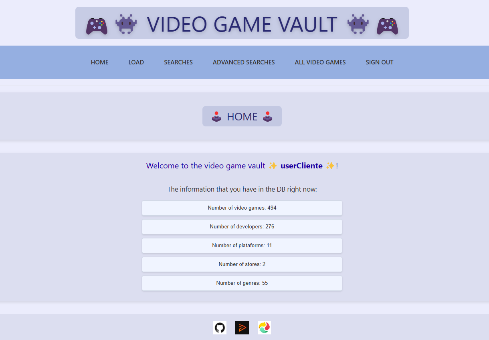

<h1 align="center">🎮👾 VideoGame_Vault 👾🎮</h1>

<p align="center">
  
  
  
  
  
  
  
  
  
</p>


## Table of Contents
- [Application Description](#application-description)
- [Steps to Start the Project](#steps-to-start-the-project)
- [License](#license)


## Application Description
**Video Game Vault** is a web application developed with **Django** that centralizes information about video games obtained through *web scraping*. The platform allows you to explore video games, perform advanced searches, and discover personalized recommendations, combining simplicity and power in one place.

**Purpose:** Video Game Vault was created as a tool to centralize video game information and facilitate their search and discovery, ideal for gamers and collectors.

### Key Features:
- **Data Retrieval:**
  - Video games are automatically collected from [**Instant Gaming**](https://www.instant-gaming.com/) and [**Eneba**](https://www.eneba.com/) using **Beautiful Soup**.
  - Data is stored in a database and organized for various searches.

- **Searches:**
  - **Simple Searches:** Directly with Django, explore video games using basic filters such as genre, developer, platform...
  - **Advanced Searches:** Use **Whoosh** for more complex queries, such as specific keyword matches.

- **Authentication for Advanced Features:**
  - Some features, such as data loading, the recommendation system, or advanced searches, are only available to authenticated users.

- **Detailed Video Game View:**
  - View details such as release date, description, price, discount, rating, developer, genres, and platforms.
  - Discover personalized recommendations based on similarities with other video games.

- **Content-Based Recommendation System:**
  - Based on content, it uses vectors that combine attributes of video games.
  - Implemented with tools like **spaCy** for natural language text processing, **scikit-learn** for similarity calculations, and **NumPy** for vector construction.

### Technologies Used:
- **Django:** The main framework for application development.
- **Beautiful Soup:** For data extraction via *web scraping*.
- **Whoosh:** Search engine for advanced queries.
- **spaCy, scikit-learn, and NumPy:** Key components for the content-based recommendation system.


## Steps to Start the Project
### Clone the Project
```bash
git clone https://github.com/Jaime-Linares/VideoGame_Vault.git
```

### Install Dependencies
You have two options to work: with or without a virtual environment.

#### 1. Install Dependencies with virtual environment
##### Using Linux
* **Create the virtual environment:**
```bash
python3 -m venv venv
``` 
* **Activate the virtual environment:**
```bash
source venv/bin/activate
``` 
* **Install dependencies:**
```bash
pip install -r requirements.txt
``` 

##### Using Windows
* **Create the virtual environment:**
```bash
python -m venv venv
``` 
* **Activate the virtual environment:**
```bash
venv\Scripts\activate
``` 
* **If you get an error related to script execution, you can temporarily modify the policy with:**
```bash
Set-ExecutionPolicy -Scope Process -ExecutionPolicy Bypass
``` 
* **Install dependencies:**
```bash
pip install -r requirements.txt
``` 

#### 2. Install Dependencies without virtual environment
To successfully run this project, the following dependencies need to be installed:

* **Install Django:**
```bash
pip install django==5.1.1
``` 
* **Install BeautifulSoup and a parser:**
```bash
pip install beautifulsoup4==4.12.3
```
```bash
pip install lxml
```
* **Install Whoosh:**
```bash
pip install whoosh==2.7.4
```
* **Install NumPy:**
```bash
pip install numpy==2.0.0
```
* **Install scikit-learn:**
```bash
pip install scikit-learn==1.5.1
```
* **Install spaCy and the required models:**
```bash
pip install spacy==3.8.3
```
```bash
pip install https://github.com/explosion/spacy-models/releases/download/en_core_web_md-3.8.0/en_core_web_md-3.8.0.tar.gz
```
```bash
pip install https://github.com/explosion/spacy-models/releases/download/es_core_news_md-3.8.0/es_core_news_md-3.8.0.tar.gz
```
* **Install langdetect:**
```bash
pip install langdetect==1.0.9
```

### Run Migrations
```bash
python manage.py migrate
```

### Start the Project
```bash
python manage.py runserver
```
* The application will be available at [http://localhost:8000/](http://localhost:8000/)

### Recommendations
First, I recommend creating an account so you can load the database, the Whoosh index, the recommendation system, and perform advanced searches using Whoosh.

### Application Preview
* Application just opened:

 

* Application after registering and loading data and the recommendation system:

 


## License  
This project is licensed under the MIT License. See the [LICENSE](LICENSE) file for details.
